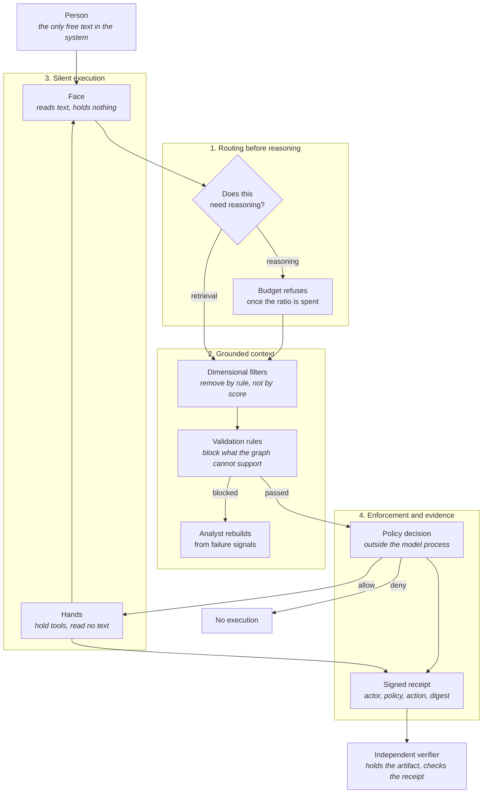
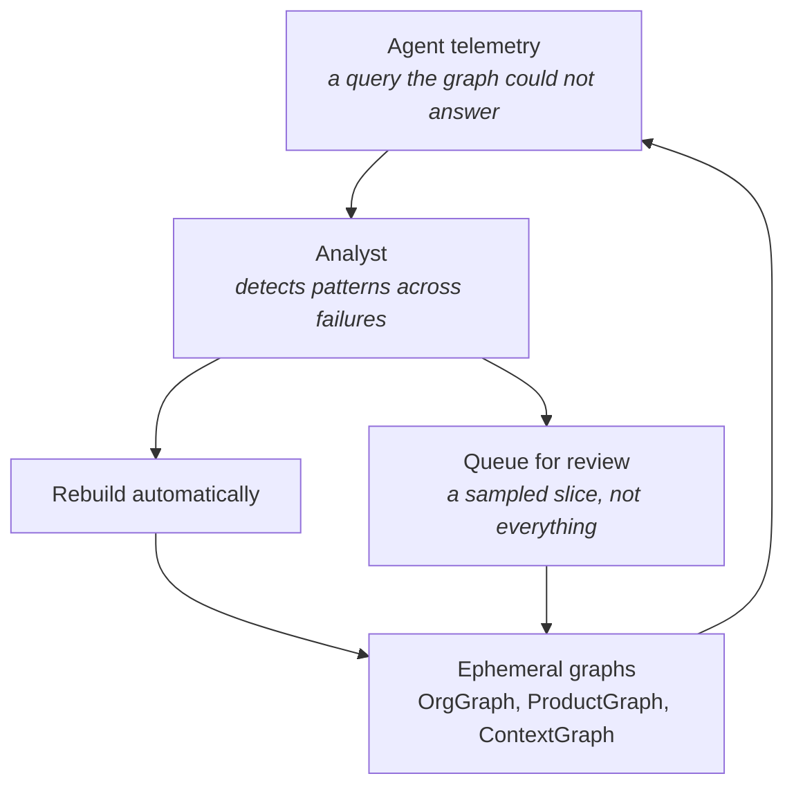

# Agentic Architecture

[](https://opensource.org/licenses/MIT)
[](https://github.com/imran-siddique/agentic-architecture/commits/main)
[](https://github.com/imran-siddique/agentic-architecture/pulls)

> **"Scale by Subtraction"**: the smartest systems aren't the ones that compute the most. They're the ones that know when NOT to compute.

A guide to agentic system design patterns, with dependency-free examples and executable checks. The patterns emphasize reducing unnecessary inference, enforcing capability boundaries, and producing evidence that can be verified outside the agent.

---

## Contents

- [Overview](#overview)
- [Why this matters](#why-this-matters)
- [Core concepts](#core-concepts) - the four patterns
- [Architecture overview](#architecture-overview) - how they compose
- [Quick start](#quick-start)
- [Benefits](#benefits)
- [Examples](#examples)
- [Evidence and claims](#evidence-and-claims)
- [Contributing](#contributing)
- [Philosophy](#philosophy)
- [Reference implementations](#reference-implementations)

---

## Overview

This repository documents architectural patterns for building agent systems that are easier to constrain, observe, and verify. The examples are reference implementations, not production components. Benchmark and threat-model them in your own environment before adopting their targets.

## Why this matters

| Traditional Approach | Agentic Architecture |
|---------------------|---------------------|
| ❌ LLM for every request | ✅ 90% lookup, 10% reasoning |
| ❌ Detect hallucinations after | ✅ Prevent hallucinations structurally |
| ❌ Agents chat with each other | ✅ Typed messages between components that hold no language |
| ❌ Static knowledge bases | ✅ Graphs rebuilt from the failures they produce |
| ❌ Add more features | ✅ Scale by subtraction |

**Design targets to measure in your environment:**
- Increase the share of requests served by deterministic lookup
- Reduce unnecessary model calls, latency, and cost
- Make policy violations fail closed at an enforcement boundary
- Bind consequential actions to independently verifiable evidence

Numbers printed by the examples are illustrative simulations, not benchmark results. See [Evidence and claims](#evidence-and-claims).

## Core concepts

The [pattern catalog](./docs/README.md) lists these with the shared template:
problem, mechanism, invariant, test, when not to use, reference implementation.

### 1. [Routing before reasoning](./docs/patterns/routing.md)
**Classify the request before you answer it.**

Merges what were three documents: The Inference Trap, The Guardrail Router, and
The Compute-to-Lookup Ratio. They described one pattern from three angles.

- Why "reasoning" is the default when nothing else can answer, and what that costs
- The router that decides which path a request takes, without calling a model to decide
- Enforcing the ratio as a constraint that can refuse, rather than a metric that drifts
- The invariant: when the reasoning budget is exhausted, no request reaches the reasoning path
- When this pattern is the wrong choice

**Key Insight**: the smartest systems are not the ones that compute the most. They are the ones that know when not to compute.

### 2. [Grounded context](./docs/patterns/grounded-context.md)
**Structure the context, enforce it, then keep it current.**

Merges what were three documents: Multidimensional Knowledge Graphs, The
Semantic Firewall, and Recursive Ontologies. They were one pattern in three
stages.

- Six dimensions that filter candidates by rule rather than by similarity score
- Six validation rules that block a claim the graph cannot support, with a reason
- Failure signals that rebuild the affected region instead of a curation backlog
- The invariant: a checkable claim is released only if every rule passes
- The two gaps this leaves, both of which are pinned by tests

**Key Insight**: the graph does not answer the question. It eliminates the wrong answers, and it inherits whatever the graph itself gets wrong.

### 3. [Silent execution](./docs/patterns/silent-execution.md)
**Language at the boundary, capability at the workers, never in the same component.**

Merges what were three documents: The Headless Agent, The Silent Swarm, and The
Mute Agent. They were one pattern from three distances.

- Why every conversational hop is a generation, a parse, and an attack surface
- The face reads text and holds nothing; the hands hold tools and read no text
- Capability manifests, and returning NULL rather than attempting out of scope
- Two invariants, both asserted by inspecting objects rather than reading prose
- A fail-open default in the example gateway, pinned by a test rather than hidden

**Key Insight**: the security claim is countable. How many components both read free text and hold a capability?

### 4. [Enforcement and evidence](./docs/patterns/enforcement-and-evidence.md)
**Put the rule where the model cannot argue with it, then prove it ran.**

Merges what were two documents: Control Planes vs Prompts and The Evidence
Plane. Enforcement without evidence leaves you trusting a log written by the
system you are checking.

- Why a system prompt is a suggestion delivered in the same channel as the attack
- Policies as code with tests, evaluated outside the model process
- Receipts that bind actor, versioned policy, action, and artifact digest
- The invariant: change the action, decision, or artifact and verification fails
- Four things a receipt does not prove, including that the policy was correct

**Key Insight**: verification is a property of evidence and a verifier, not a word in an agent's response.

### 5. [The Cognitive Systems Architect](./docs/cognitive-systems-architect.md)
**The new role that replaces the traditional Software Engineer.**

As AI agents become capable of writing code, the human role shifts to knowledge architecture and system design. This document explores:
- Core responsibilities (knowledge architecture, cognitive orchestration, optimization, recursive ontology management)
- Key skills (information architecture, system design, performance engineering)
- Day-to-day activities and deliverables
- Tools and technologies
- Career path from junior to principal architect
- Transition guide for software engineers

**Key Insight**: The best code is no code. The best architect designs systems that don't need to compute what they can look up. And the best knowledge graph is one that updates itself.

## Architecture overview

The four patterns compose. Each one hands the next a narrower problem.



Read the flow as four questions, asked in order: does this deserve computation,
what is this allowed to see and claim, who is allowed to act on it, and can
anyone outside prove what happened.

The share of traffic on each path is yours to measure. It is deliberately not
drawn here, because a number on an architecture diagram becomes a target
somebody defends.

### The loop inside grounded context

The third stage of pattern two is the part people skip, and the reason the
other two stages decay without it. Failures are not errors, they are the input
to the next version of the graph.



The sampling rate is a design choice with a real trade: review too little and
drift compounds silently, review everything and you have rebuilt the curation
backlog the pattern exists to remove.

## Quick start

<details>
<summary><b>For developers</b></summary>

### 1. Understand the Philosophy
Read the concepts in order:

| # | Concept | Learn |
|---|---------|-------|
| 1 | [Routing before reasoning](./docs/patterns/routing.md) | Classify before you answer, and enforce the budget |
| 2 | [Grounded context](./docs/patterns/grounded-context.md) | Filter by rule, block unsupported claims, heal from failures |
| 3 | [Silent execution](./docs/patterns/silent-execution.md) | Language at the boundary, capability at the workers |
| 4 | [Enforcement and evidence](./docs/patterns/enforcement-and-evidence.md) | Put the rule outside the model, then prove it ran |
| 5 | [Cognitive Systems Architect](./docs/cognitive-systems-architect.md) | The holistic view |

### 2. Assess Your Current System
- [ ] What share of your requests actually needs a model?
- [ ] Is that share enforced, or only measured?
- [ ] Where are hallucinations possible?
- [ ] How much do inter-agent LLM calls cost?
- [ ] Is your knowledge architecture documented?

### 3. Run the checks, not just the examples
```bash
# The examples are simulations. They print no measurement.
python examples/guardrail_router_example.py
python examples/semantic_firewall_example.py

# These are the part that can fail.
python -m unittest discover -s tests -v
```

</details>

<details>
<summary><b>For architects</b></summary>

### Design checklist

**Before adopting anything here:**
- [ ] Measure what share of requests is genuinely novel. If it is most of them, routing buys you a hop and nothing else
- [ ] Establish whether anyone in the organisation can say what is true. A graph does not settle that, it records it
- [ ] Identify who verifies. If no party outside the producing system checks a receipt, you are building an expensive log

**Routing:**
- [ ] Make the reasoning share a constraint that refuses, not a metric on a dashboard
- [ ] Keep classification cheap. A classifier that costs a model call has moved the trap, not removed it
- [ ] Write reasoning results back, so the ratio improves without anyone tending it

**Grounded context:**
- [ ] Measure extraction coverage first. It bounds everything the firewall can do
- [ ] Name an owner for the graph. An unowned graph fails silently and audits cleanly
- [ ] Decide the human sampling rate deliberately

**Silent execution:**
- [ ] Count the components that read free text and hold a capability. Drive it to zero
- [ ] Decide whether an unmapped operation is open or closed, and write the test either way
- [ ] Give every worker a manifest, and let it return nothing

**Enforcement and evidence:**
- [ ] Move policy evaluation out of the model process
- [ ] Version the policy id, or the receipt binds nothing
- [ ] Put the signing key somewhere the agent cannot reach
- [ ] Test tampering, replay, unknown keys, denied actions, and rotation

</details>

## Benefits

None of these are guaranteed by adopting a pattern. Each is a property you can
go and measure once the mechanism is in place, which is why the third column
exists.

| Property | Mechanism | Evidence to collect |
|--------|--------|-----|
| Performance | Caching and lookup optimization | Latency distribution by route |
| Cost | Fewer model calls | Cost per successful task |
| Safety | Enforcement outside prompts | Adversarial policy test results |
| Scalability | Stateless, parallel execution | Load-test throughput and saturation |
| Observability | Structured telemetry | Trace completeness and dropped-event rate |
| Predictability | Deterministic paths where possible | Replay agreement and failure distribution |

## Examples

Every example is dependency-free, self-contained, and calls no model. Each one
prints a banner saying so, because the numbers they print are constants in the
file rather than measurements.

| Pattern | Examples | Tests |
|---|---|---|
| Routing before reasoning | `guardrail_router_example.py`, `compute_to_lookup_example.py` | `test_routing_invariants.py` |
| Grounded context | `multidimensional_kg_example.py`, `semantic_firewall_example.py`, `recursive_ontology_example.py` | `test_grounding_invariants.py` |
| Silent execution | `headless_agent_example.py`, `silent_swarm_example.py` | `test_silence_invariants.py` |
| Enforcement and evidence | `evidence_plane_example.py` | `test_evidence_plane.py` |

```bash
python -m unittest discover -s tests -v    # 36 checks
ruff check examples tests
```

On Windows, prefix example runs with `PYTHONIOENCODING=utf-8`.

## Evidence and claims

The repository separates three kinds of statements:

- **Invariant**: enforced by code and covered by a test, such as rejecting a receipt when its artifact changes.
- **Measurement**: produced by a named benchmark in a stated environment.
- **Design target**: a goal that adopters must validate against their own workload and threat model.

Pull requests that add quantitative or security claims should include the command, fixture or dataset, environment, and raw result needed to reproduce them. CI lints, compiles every example, runs the executable checks, and smoke-tests each example.

All four patterns have executable invariants: routing, grounded context, silent execution, and enforcement and evidence. Two of those suites also pin the documented **limits** of a claim, so that a gap named in prose cannot silently close or widen.

## Contributing

This is a living document. Contributions welcome:

- 💬 Share implementation experiences
- 🆕 Propose new patterns
- 📋 Submit case studies
- 📝 Improve documentation

See [CONTRIBUTING.md](./CONTRIBUTING.md) for guidelines.

## Learn more

Each concept document includes:
- Detailed explanations with diagrams
- Code examples in Python
- Real-world case studies
- Implementation checklists
- Metrics to track
- Common anti-patterns to avoid

## Philosophy

<table>
<tr><td>

> "If your agent is 'thinking' for every request, you haven't built an agent; you've built a philosophy major."

</td></tr>
<tr><td>

> "The smartest systems aren't the ones that compute the most. They're the ones that know when NOT to compute."

</td></tr>
<tr><td>

> "Don't detect hallucinations after generation. Prevent them structurally before they reach users."

</td></tr>
<tr><td>

> "Language is for humans. Code is for machines. Keep them separate."

</td></tr>
<tr><td>

> "Stop judging agents by how well they chat. Start judging them by how well they shut up and work."

</td></tr>
<tr><td>

> "An agent that returns NULL when uncertain is infinitely more valuable than one that confidently hallucinates."

</td></tr>
<tr><td>

> "You wouldn't secure a web app with strongly-worded comments. Don't secure AI agents with strongly-worded prompts."

</td></tr>
</table>

---

## Reference implementations

Each pattern names where its ideas exist as running code, and what that code
does not do. Collected here:

| Project | What it is | Which pattern cites it |
|---|---|---|
| [TRACE](https://github.com/agentrust-io/trace-spec) | Record format plus conformance suite, so a receipt can be checked by a party that does not trust the producer | Enforcement and evidence, grounded context |
| [cMCP](https://github.com/agentrust-io/cmcp) | Policy-enforcing MCP proxy, evaluating policy outside the model process on the tool call path | All four |
| [Agent Manifest](https://github.com/agentrust-io/agent-manifest) | Declared capability and scope for an agent, as a verifiable document | Silent execution, routing |
| [Agent Governance Toolkit](https://github.com/microsoft/agent-governance-toolkit) | Policy kernel and agent mesh work, where the Agent OS and AgentMesh prototypes now live | Routing, silent execution, enforcement |

These are cited because they are open, running, and independently checkable.
None of them implements a pattern end to end, and the pattern documents say
which half each one covers.

## Additional documentation

- **[Pattern catalog](./docs/README.md)** - The four patterns, the template they share, and where the eleven old documents went
- **[Agent Mesh Patterns](./docs/agent-mesh-patterns.md)** - Identity, trust, governance, and reward notes from two prototypes
- **[Production Deployment Guide](./docs/production-deployment-guide.md)** - CI/CD, observability, operational practice
- **[Security policy](./SECURITY.md)** - What this repository is, and what counts as a vulnerability in it
