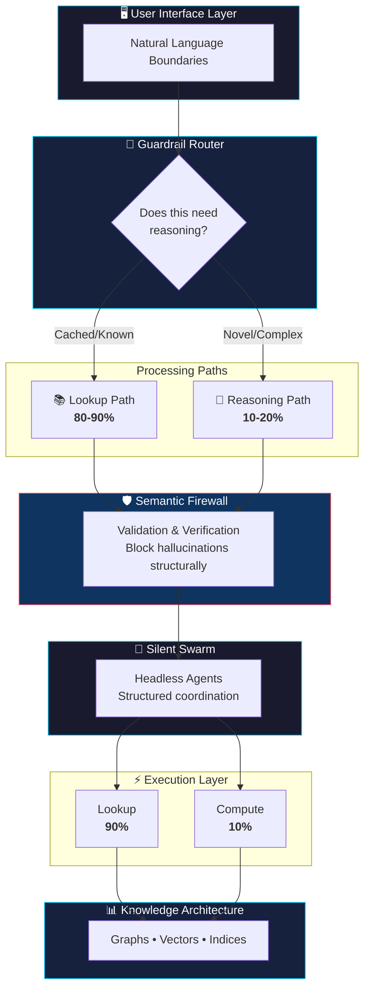
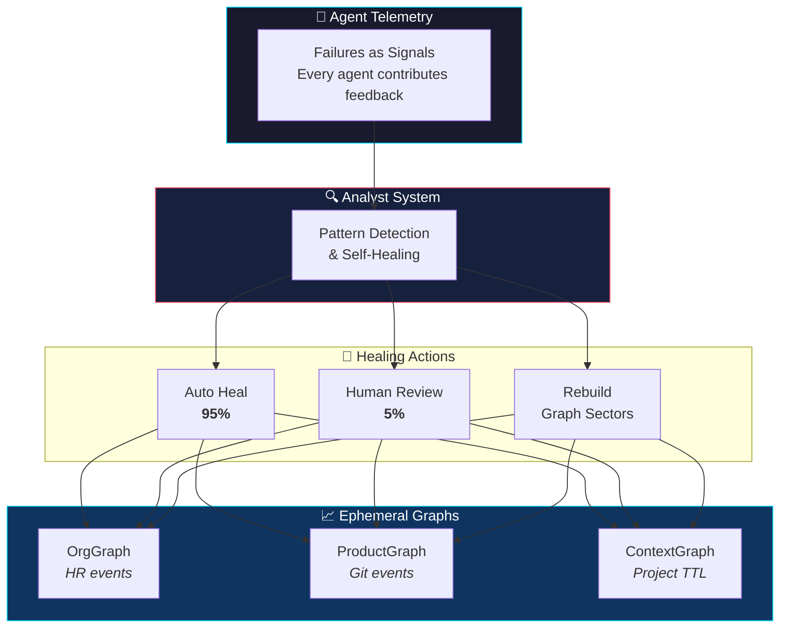

# Agentic Architecture

[](https://opensource.org/licenses/MIT)
[](https://github.com/imran-siddique/agentic-architecture/stargazers)
[](https://github.com/imran-siddique/agentic-architecture/commits/main)
[](https://github.com/imran-siddique/agentic-architecture/pulls)

> **"Scale by Subtraction"**: the smartest systems aren't the ones that compute the most. They're the ones that know when NOT to compute.

A guide to agentic system design patterns, with dependency-free examples and executable checks. The patterns emphasize reducing unnecessary inference, enforcing capability boundaries, and producing evidence that can be verified outside the agent.

---

## 📖 Table of Contents

- [Overview](#overview)
- [Why This Matters](#-why-this-matters)
- [Core Concepts](#-core-concepts)
- [Architecture Overview](#-architecture-overview)
- [Quick Start](#-quick-start)
- [Benefits](#-benefits)
- [Examples](#-examples)
- [Contributing](#-contributing)
- [Philosophy](#-philosophy)

---

## Overview

This repository documents architectural patterns for building agent systems that are easier to constrain, observe, and verify. The examples are reference implementations, not production components. Benchmark and threat-model them in your own environment before adopting their targets.

## 🎯 Why This Matters

| Traditional Approach | Agentic Architecture |
|---------------------|---------------------|
| ❌ LLM for every request | ✅ 90% lookup, 10% reasoning |
| ❌ Detect hallucinations after | ✅ Prevent hallucinations structurally |
| ❌ Agents chat with each other | ✅ Silent swarms with structured data |
| ❌ Static knowledge bases | ✅ Self-healing recursive ontologies |
| ❌ Add more features | ✅ Scale by subtraction |

**Design targets to measure in your environment:**
- Increase the share of requests served by deterministic lookup
- Reduce unnecessary model calls, latency, and cost
- Make policy violations fail closed at an enforcement boundary
- Bind consequential actions to independently verifiable evidence

Numbers printed by the examples are illustrative simulations, not benchmark results. See [Evidence and claims](#-evidence-and-claims).

## 🧠 Core Concepts

### 1. [The Inference Trap](./docs/inference-trap.md)
**Why "Thinking" is a Technical Debt.**

Engineers are falling into the Inference Trap: throwing massive reasoning models at problems that are actually just retrieval problems. This document explores:
- The misconception that AI and Search are independent
- Why reasoning must have a "reason" (compute and latency costs)
- The Scale by Subtraction philosophy (removing capabilities)
- The missing component: The Guardrail Router
- The target ratio: 80-90% Lookup, 10-20% Reasoning

**Key Insight**: If your agent is "thinking" for every request, you haven't built an agent; you've built a philosophy major. In production, we need engineers, not philosophers.

### 2. [The Guardrail Router](./docs/guardrail-router.md)
**The Decision Module That Prevents the Inference Trap.**

The Guardrail Router is a critical component that sits before your AI system and decides: "Does this actually require reasoning?" This document covers:
- Request classification without expensive processing
- Constraint enforcement to maintain healthy ratios
- Smart routing between lookup and reasoning paths
- Metrics tracking and optimization
- Real-world implementation patterns

**Key Insight**: The smartest systems aren't the ones that compute the most. They're the ones that know when NOT to compute.

### 3. [The Compute-to-Lookup Ratio](./docs/compute-to-lookup-ratio.md)
**Why 90% of your agent's work should be "dumb" lookup, not "smart" reasoning.**

Modern agentic systems achieve optimal performance by prioritizing fast, reliable lookups over expensive LLM computation. This document explores:
- The 90/10 rule for lookup vs. computation
- Performance and cost benefits
- Implementation strategies (caching, knowledge graphs, semantic indexing)
- Real-world examples with 10x performance improvements
- Metrics to track and optimize

**Key Insight**: The smartest agents aren't the ones that think the hardest. They're the ones that know where to look.

### 4. [Multidimensional Knowledge Graphs](./docs/multidimensional-knowledge-graphs.md)
**Beyond Flat Context: Scale by Subtraction Using Graph Constraints.**

Context is not just a pile of documents in a Vector Database. RAG is flat. It finds similar words but doesn't understand the structure of reality. This document covers:
- The problem with flat context (RAG limitations)
- The graph as a semantic firewall (constraint wrapper)
- Six dimensions: Identity & Scope, Organizational Hierarchy, Service Ownership, Dependencies, Temporal Weight, Authority
- Real-world example: "What pending items do I have on my plate?"
- The constraint outcome: Subtracting 99% of noise before the LLM sees anything
- Comparing RAG vs. Multidimensional approaches

**Key Insight**: The Graph doesn't answer questions. It eliminates wrong answers. By filtering the universe through dimensional constraints, we subtract 99% of noise using deterministic graph logic, leaving the AI with the easy job of summarizing the 1% of signal that remains.

### 5. [The Semantic Firewall](./docs/semantic-firewall.md)
**Using Multidimensional Knowledge Graphs to block hallucinations before they happen.**

A defense-in-depth architecture that prevents AI hallucinations through structural validation against knowledge graphs. This document covers:
- Multidimensional knowledge graph design (entity, temporal, confidence, context)
- Six validation rules for blocking hallucinations
- Implementation patterns for proactive protection
- Benefits over post-generation detection
- Real-world implementation examples

**Key Insight**: Don't detect hallucinations after generation. Prevent them structurally before they reach users.

### 6. [The "Headless" Agent](./docs/headless-agent.md)
**Why the best agents are the ones that can't talk (Silent Swarms).**

Challenging the assumption that agents must communicate through natural language, this document presents:
- The performance bottleneck of conversational interfaces
- Headless architecture with structured data exchange
- Silent Swarm patterns for agent coordination
- 10-100x performance improvements
- 90%+ cost reduction through eliminating inter-agent LLM calls
- When to use headless vs. conversational patterns

**Key Insight**: Language is for humans. Code is for machines. Keep them separate.

### 7. [The Silent Swarm](./docs/silent-swarm.md)
**Function Over Form: Scale by Subtraction Through "Security by Silence".**

The AI industry suffers from a "Chatbot Hangover". We design systems as if conversation is mandatory. This document challenges that assumption:
- The Code Review Paradox: We want the work, not the worker's personality
- Separation of Concerns: "The Face" (can talk, no tools) vs. "The Hands" (can execute, no talk)
- Security by Silence: Jailbreak-resistant architecture
- 90% of agents should be mute
- Function over form in multi-agent coordination

**Key Insight**: Stop judging agents by how well they chat. Start judging them by how well they shut up and work.

### 8. [Recursive Ontologies](./docs/recursive-ontologies.md)
**Self-Updating Semantic Firewalls (Part 4).**

Static systems die. In a world where data changes every second, knowledge graphs cannot remain static. This document introduces recursive ontologies, systems that update themselves:
- The Feedback Loop: Agents as telemetry (failures as signals)
- Ephemeral Graphs: Event-driven, just-in-time knowledge bases
- Human Wisdom: Statistical supervision (5% review, 95% automation)
- The Analyst System: Pattern detection and self-healing
- Real-world implementation of self-updating architectures
- The death of manual knowledge curation

**Key Insight**: When an agent fails to find an answer, that is not an error. It is a signal. The system heals its own knowledge gaps based on the friction points of the agents living inside it.

### 9. [The Cognitive Systems Architect](./docs/cognitive-systems-architect.md)
**The new role that replaces the traditional Software Engineer.**

As AI agents become capable of writing code, the human role shifts to knowledge architecture and system design. This document explores:
- Core responsibilities (knowledge architecture, cognitive orchestration, optimization, recursive ontology management)
- Key skills (information architecture, system design, performance engineering)
- Day-to-day activities and deliverables
- Tools and technologies
- Career path from junior to principal architect
- Transition guide for software engineers

**Key Insight**: The best code is no code. The best architect designs systems that don't need to compute what they can look up. And the best knowledge graph is one that updates itself.

### 10. [The Mute Agent](./docs/mute-agent.md) 🆕
**Capability-Based Execution: Return NULL, Don't Hallucinate.**

The most reliable agent is one that knows when to say nothing. This pattern implements capability-based execution where agents return NULL for out-of-scope requests instead of fabricating answers:
- Capability manifests: What the agent CAN do (not what it might try)
- NULL responses: Silence is better than hallucination
- POSIX-inspired permissions: Fine-grained access control
- Policy enforcement: Deterministic rules, not probabilistic guardrails
- The 0% violation guarantee: Structural safety over prompt engineering

**Key Insight**: An agent that returns NULL when uncertain is infinitely more valuable than one that confidently hallucinates.

### 11. [Control Planes vs Prompts](./docs/control-planes-vs-prompts.md) 🆕
**Why Deterministic Infrastructure Beats Probabilistic Prompting.**

Stop trying to "prompt engineer" your way to safety. This pattern establishes control plane architecture for AI governance:
- Prompts are suggestions, policies are laws
- Kernel-level enforcement: Safety below the LLM layer
- Permission systems: What agents CAN do, not what they SHOULD do
- Audit trails: Every action logged, every decision traceable
- Rollback capability: Undo any agent action

**Key Insight**: You wouldn't secure a web app with strongly-worded comments. Don't secure AI agents with strongly-worded prompts.

### 12. [The Evidence Plane](./docs/evidence-plane.md) 🆕
**Trust the receipt, not the label.**

An agent saying an action is verified does not make it so. This pattern binds workload identity, policy decision, action, and artifact digest into a receipt that can be checked outside the producing agent.

**Key Insight**: Verification is a property of evidence and a verifier, not a word in an agent's response.

## 🏗️ Architecture Overview

These concepts work together to form a complete architectural philosophy:



### Evolution Layer: Recursive Ontologies

Static systems die. **Recursive Ontologies** add a self-updating layer:



**Key Insight**: The system doesn't need manual updates. Agent failures signal knowledge gaps. The Analyst System detects patterns and triggers automatic healing.

## 🚀 Quick Start

<details>
<summary><b>👨‍💻 For Developers</b></summary>

### 1. Understand the Philosophy
Read the concepts in order:

| # | Concept | Learn |
|---|---------|-------|
| 1 | [The Inference Trap](./docs/inference-trap.md) | Why "thinking" is technical debt |
| 2 | [The Guardrail Router](./docs/guardrail-router.md) | Prevent expensive reasoning misuse |
| 3 | [Compute-to-Lookup Ratio](./docs/compute-to-lookup-ratio.md) | The 90/10 performance foundation |
| 4 | [Multidimensional Knowledge Graphs](./docs/multidimensional-knowledge-graphs.md) | Constraint-based filtering |
| 5 | [Semantic Firewall](./docs/semantic-firewall.md) | Structural hallucination prevention |
| 6 | [Headless Agent](./docs/headless-agent.md) | Efficient coordination |
| 7 | [Silent Swarm](./docs/silent-swarm.md) | Security by silence |
| 8 | [Recursive Ontologies](./docs/recursive-ontologies.md) | Self-updating knowledge |
| 9 | [The Mute Agent](./docs/mute-agent.md) | Capability-based execution |
| 10 | [Control Planes vs Prompts](./docs/control-planes-vs-prompts.md) | Deterministic safety |
| 11 | [Cognitive Systems Architect](./docs/cognitive-systems-architect.md) | The holistic view |

### 2. Assess Your Current System
- [ ] Are you falling into the Inference Trap?
- [ ] What's your compute-to-lookup ratio?
- [ ] Where are hallucinations possible?
- [ ] How much do inter-agent LLM calls cost?
- [ ] Is your knowledge architecture documented?

### 3. Implement Incrementally
```bash
# Start with the examples
cd examples/
python guardrail_router_example.py
python semantic_firewall_example.py
```

</details>

<details>
<summary><b>🏛️ For Architects</b></summary>

### Design Checklist

**Knowledge-First Systems:**
- [ ] Implement Guardrail Router as first line of defense
- [ ] Map your domain's knowledge requirements
- [ ] Design multidimensional knowledge graphs
- [ ] Plan pre-computation and indexing strategies
- [ ] Define validation rules and confidence thresholds

**Optimize for Lookup:**
- [ ] Target 80-90% lookup, 10-20% reasoning
- [ ] Implement multi-tier caching
- [ ] Build comprehensive indices
- [ ] Pre-compute common queries

**Build Trust Through Structure:**
- [ ] Implement semantic firewalls
- [ ] Define validation rules
- [ ] Track confidence scores
- [ ] Maintain source attribution

**Coordinate Efficiently:**
- [ ] Use headless agents for inter-system communication
- [ ] Reserve natural language for human boundaries
- [ ] Implement event-driven architectures
- [ ] Design for observability with structured telemetry

</details>

## 📊 Benefits

Systems designed with these principles achieve:

| Property | Mechanism | Evidence to collect |
|--------|--------|-----|
| Performance | Caching and lookup optimization | Latency distribution by route |
| Cost | Fewer model calls | Cost per successful task |
| Safety | Enforcement outside prompts | Adversarial policy test results |
| Scalability | Stateless, parallel execution | Load-test throughput and saturation |
| Observability | Structured telemetry | Trace completeness and dropped-event rate |
| Predictability | Deterministic paths where possible | Replay agreement and failure distribution |

## 💡 Examples

All patterns include working Python examples:

```bash
examples/
├── guardrail_router_example.py    # Request classification & routing
├── compute_to_lookup_example.py   # 90/10 optimization patterns
├── semantic_firewall_example.py   # Hallucination prevention
├── multidimensional_kg_example.py # Knowledge graph constraints
├── headless_agent_example.py      # Structured communication
├── silent_swarm_example.py        # Multi-agent coordination
└── recursive_ontology_example.py  # Self-healing systems
```

## 🧪 Evidence and Claims

The repository separates three kinds of statements:

- **Invariant**: enforced by code and covered by a test, such as rejecting a receipt when its artifact changes.
- **Measurement**: produced by a named benchmark in a stated environment.
- **Design target**: a goal that adopters must validate against their own workload and threat model.

Pull requests that add quantitative or security claims should include the command, fixture or dataset, environment, and raw result needed to reproduce them. CI compiles every example, runs the executable checks, and smoke-tests each example.

## 🤝 Contributing

This is a living document. Contributions welcome:

- 💬 Share implementation experiences
- 🆕 Propose new patterns
- 📋 Submit case studies
- 📝 Improve documentation

See [CONTRIBUTING.md](./CONTRIBUTING.md) for guidelines.

## 📚 Learn More

Each concept document includes:
- Detailed explanations with diagrams
- Code examples in Python
- Real-world case studies
- Implementation checklists
- Metrics to track
- Common anti-patterns to avoid

## 💭 Philosophy

<table>
<tr><td>

> "If your agent is 'thinking' for every request, you haven't built an agent; you've built a philosophy major."

</td></tr>
<tr><td>

> "The smartest systems aren't the ones that compute the most. They're the ones that know when NOT to compute."

</td></tr>
<tr><td>

> "Don't detect hallucinations after generation. Prevent them structurally before they reach users."

</td></tr>
<tr><td>

> "Language is for humans. Code is for machines. Keep them separate."

</td></tr>
<tr><td>

> "Stop judging agents by how well they chat. Start judging them by how well they shut up and work."

</td></tr>
<tr><td>

> "An agent that returns NULL when uncertain is infinitely more valuable than one that confidently hallucinates."

</td></tr>
<tr><td>

> "You wouldn't secure a web app with strongly-worded comments. Don't secure AI agents with strongly-worded prompts."

</td></tr>
</table>

---

## 🔗 Related Projects

- **[Agent OS](https://github.com/microsoft/agent-governance-toolkit)** - Safety-First Kernel implementing these patterns (0% policy violations)
- **[AgentMesh](https://github.com/microsoft/agent-governance-toolkit)** - The Secure Nervous System for Cloud-Native Agent Ecosystems

## 📚 Additional Documentation

- **[Agent Mesh Patterns](./docs/agent-mesh-patterns.md)** - Identity, Trust, Governance, Reward patterns
- **[Production Deployment Guide](./docs/production-deployment-guide.md)** - CI/CD, observability, operational best practices

---

<p align="center">
  <b>Built with ❤️ for the future of agentic systems</b>
  <br><br>
  <a href="https://github.com/imran-siddique/agentic-architecture/stargazers">⭐ Star this repo</a> if you find it useful!
</p>
