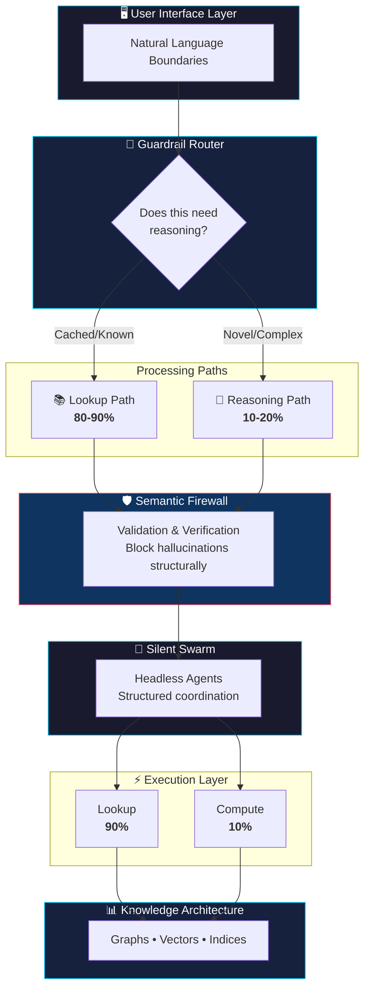
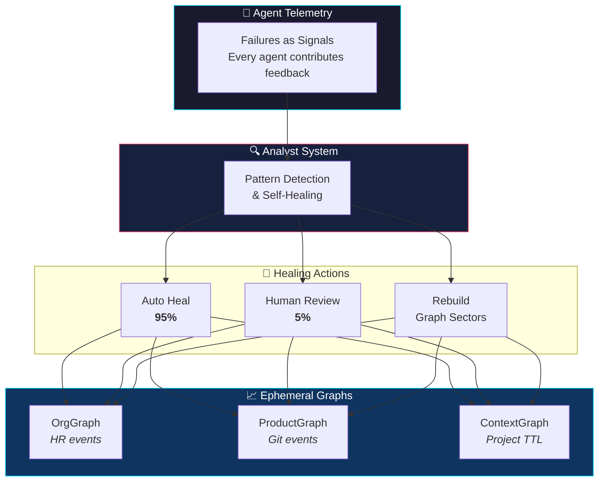

# Agentic Architecture

[](https://opensource.org/licenses/MIT)
[](https://github.com/imran-siddique/agentic-architecture/commits/main)
[](https://github.com/imran-siddique/agentic-architecture/pulls)

> **"Scale by Subtraction"**: the smartest systems aren't the ones that compute the most. They're the ones that know when NOT to compute.

A guide to agentic system design patterns, with dependency-free examples and executable checks. The patterns emphasize reducing unnecessary inference, enforcing capability boundaries, and producing evidence that can be verified outside the agent.

---

## Table of Contents

- [Overview](#overview)
- [Why This Matters](#why-this-matters)
- [Core Concepts](#core-concepts)
- [Architecture Overview](#architecture-overview)
- [Quick Start](#quick-start)
- [Benefits](#benefits)
- [Examples](#examples)
- [Contributing](#contributing)
- [Philosophy](#philosophy)

---

## Overview

This repository documents architectural patterns for building agent systems that are easier to constrain, observe, and verify. The examples are reference implementations, not production components. Benchmark and threat-model them in your own environment before adopting their targets.

## Why This Matters

| Traditional Approach | Agentic Architecture |
|---------------------|---------------------|
| ❌ LLM for every request | ✅ 90% lookup, 10% reasoning |
| ❌ Detect hallucinations after | ✅ Prevent hallucinations structurally |
| ❌ Agents chat with each other | ✅ Silent swarms with structured data |
| ❌ Static knowledge bases | ✅ Self-healing recursive ontologies |
| ❌ Add more features | ✅ Scale by subtraction |

**Design targets to measure in your environment:**
- Increase the share of requests served by deterministic lookup
- Reduce unnecessary model calls, latency, and cost
- Make policy violations fail closed at an enforcement boundary
- Bind consequential actions to independently verifiable evidence

Numbers printed by the examples are illustrative simulations, not benchmark results. See [Evidence and claims](#evidence-and-claims).

## Core Concepts

The [pattern catalog](./docs/README.md) lists these with the shared template:
problem, mechanism, invariant, test, when not to use, reference implementation.

### 1. [Routing before reasoning](./docs/patterns/routing.md)
**Classify the request before you answer it.**

Merges what were three documents: The Inference Trap, The Guardrail Router, and
The Compute-to-Lookup Ratio. They described one pattern from three angles.

- Why "reasoning" is the default when nothing else can answer, and what that costs
- The router that decides which path a request takes, without calling a model to decide
- Enforcing the ratio as a constraint that can refuse, rather than a metric that drifts
- The invariant: when the reasoning budget is exhausted, no request reaches the reasoning path
- When this pattern is the wrong choice

**Key Insight**: the smartest systems are not the ones that compute the most. They are the ones that know when not to compute.

### 2. [Grounded context](./docs/patterns/grounded-context.md)
**Structure the context, enforce it, then keep it current.**

Merges what were three documents: Multidimensional Knowledge Graphs, The
Semantic Firewall, and Recursive Ontologies. They were one pattern in three
stages.

- Six dimensions that filter candidates by rule rather than by similarity score
- Six validation rules that block a claim the graph cannot support, with a reason
- Failure signals that rebuild the affected region instead of a curation backlog
- The invariant: a checkable claim is released only if every rule passes
- The two gaps this leaves, both of which are pinned by tests

**Key Insight**: the graph does not answer the question. It eliminates the wrong answers, and it inherits whatever the graph itself gets wrong.

### 3. [Silent execution](./docs/patterns/silent-execution.md)
**Language at the boundary, capability at the workers, never in the same component.**

Merges what were three documents: The Headless Agent, The Silent Swarm, and The
Mute Agent. They were one pattern from three distances.

- Why every conversational hop is a generation, a parse, and an attack surface
- The face reads text and holds nothing; the hands hold tools and read no text
- Capability manifests, and returning NULL rather than attempting out of scope
- Two invariants, both asserted by inspecting objects rather than reading prose
- A fail-open default in the example gateway, pinned by a test rather than hidden

**Key Insight**: the security claim is countable. How many components both read free text and hold a capability?

### 4. [The Cognitive Systems Architect](./docs/cognitive-systems-architect.md)
**The new role that replaces the traditional Software Engineer.**

As AI agents become capable of writing code, the human role shifts to knowledge architecture and system design. This document explores:
- Core responsibilities (knowledge architecture, cognitive orchestration, optimization, recursive ontology management)
- Key skills (information architecture, system design, performance engineering)
- Day-to-day activities and deliverables
- Tools and technologies
- Career path from junior to principal architect
- Transition guide for software engineers

**Key Insight**: The best code is no code. The best architect designs systems that don't need to compute what they can look up. And the best knowledge graph is one that updates itself.

### 5. [Control Planes vs Prompts](./docs/control-planes-vs-prompts.md)
**Why Deterministic Infrastructure Beats Probabilistic Prompting.**

Stop trying to "prompt engineer" your way to safety. This pattern establishes control plane architecture for AI governance:
- Prompts are suggestions, policies are laws
- Kernel-level enforcement: Safety below the LLM layer
- Permission systems: What agents CAN do, not what they SHOULD do
- Audit trails: Every action logged, every decision traceable
- Rollback capability: Undo any agent action

**Key Insight**: You wouldn't secure a web app with strongly-worded comments. Don't secure AI agents with strongly-worded prompts.

### 6. [The Evidence Plane](./docs/evidence-plane.md)
**Trust the receipt, not the label.**

An agent saying an action is verified does not make it so. This pattern binds workload identity, policy decision, action, and artifact digest into a receipt that can be checked outside the producing agent.

**Key Insight**: Verification is a property of evidence and a verifier, not a word in an agent's response.

## Architecture Overview

These concepts work together to form a complete architectural philosophy:



### Evolution Layer: Recursive Ontologies

Static systems die. **Recursive Ontologies** add a self-updating layer:



**Key Insight**: The system doesn't need manual updates. Agent failures signal knowledge gaps. The Analyst System detects patterns and triggers automatic healing.

## Quick Start

<details>
<summary><b>👨‍💻 For Developers</b></summary>

### 1. Understand the Philosophy
Read the concepts in order:

| # | Concept | Learn |
|---|---------|-------|
| 1 | [Routing before reasoning](./docs/patterns/routing.md) | Classify before you answer, and enforce the budget |
| 2 | [Grounded context](./docs/patterns/grounded-context.md) | Filter by rule, block unsupported claims, heal from failures |
| 3 | [Silent execution](./docs/patterns/silent-execution.md) | Language at the boundary, capability at the workers |
| 4 | [Control Planes vs Prompts](./docs/control-planes-vs-prompts.md) | Putting the rule where the model cannot reach it |
| 5 | [The Evidence Plane](./docs/evidence-plane.md) | Receipts a third party can check |
| 6 | [Cognitive Systems Architect](./docs/cognitive-systems-architect.md) | The holistic view |

### 2. Assess Your Current System
- [ ] What share of your requests actually needs a model?
- [ ] Is that share enforced, or only measured?
- [ ] Where are hallucinations possible?
- [ ] How much do inter-agent LLM calls cost?
- [ ] Is your knowledge architecture documented?

### 3. Implement Incrementally
```bash
# Start with the examples
python examples/guardrail_router_example.py
python examples/semantic_firewall_example.py
```

</details>

<details>
<summary><b>🏛️ For Architects</b></summary>

### Design Checklist

**Knowledge-First Systems:**
- [ ] Implement Guardrail Router as first line of defense
- [ ] Map your domain's knowledge requirements
- [ ] Design multidimensional knowledge graphs
- [ ] Plan pre-computation and indexing strategies
- [ ] Define validation rules and confidence thresholds

**Optimize for Lookup:**
- [ ] Target 80-90% lookup, 10-20% reasoning
- [ ] Implement multi-tier caching
- [ ] Build comprehensive indices
- [ ] Pre-compute common queries

**Build Trust Through Structure:**
- [ ] Implement semantic firewalls
- [ ] Define validation rules
- [ ] Track confidence scores
- [ ] Maintain source attribution

**Coordinate Efficiently:**
- [ ] Use headless agents for inter-system communication
- [ ] Reserve natural language for human boundaries
- [ ] Implement event-driven architectures
- [ ] Design for observability with structured telemetry

</details>

## Benefits

Systems designed with these principles achieve:

| Property | Mechanism | Evidence to collect |
|--------|--------|-----|
| Performance | Caching and lookup optimization | Latency distribution by route |
| Cost | Fewer model calls | Cost per successful task |
| Safety | Enforcement outside prompts | Adversarial policy test results |
| Scalability | Stateless, parallel execution | Load-test throughput and saturation |
| Observability | Structured telemetry | Trace completeness and dropped-event rate |
| Predictability | Deterministic paths where possible | Replay agreement and failure distribution |

## Examples

All patterns include working Python examples:

```bash
examples/
├── guardrail_router_example.py    # Request classification & routing
├── compute_to_lookup_example.py   # 90/10 optimization patterns
├── semantic_firewall_example.py   # Hallucination prevention
├── multidimensional_kg_example.py # Knowledge graph constraints
├── headless_agent_example.py      # Structured communication
├── silent_swarm_example.py        # Multi-agent coordination
└── recursive_ontology_example.py  # Self-healing systems
```

## Evidence and Claims

The repository separates three kinds of statements:

- **Invariant**: enforced by code and covered by a test, such as rejecting a receipt when its artifact changes.
- **Measurement**: produced by a named benchmark in a stated environment.
- **Design target**: a goal that adopters must validate against their own workload and threat model.

Pull requests that add quantitative or security claims should include the command, fixture or dataset, environment, and raw result needed to reproduce them. CI lints, compiles every example, runs the executable checks, and smoke-tests each example.

Four patterns currently have executable invariants: the evidence plane, routing, silence and capability, and the semantic firewall. Two of those suites also pin the documented **limits** of a claim, so that a gap named in prose cannot silently close or widen.

## Contributing

This is a living document. Contributions welcome:

- 💬 Share implementation experiences
- 🆕 Propose new patterns
- 📋 Submit case studies
- 📝 Improve documentation

See [CONTRIBUTING.md](./CONTRIBUTING.md) for guidelines.

## Learn More

Each concept document includes:
- Detailed explanations with diagrams
- Code examples in Python
- Real-world case studies
- Implementation checklists
- Metrics to track
- Common anti-patterns to avoid

## Philosophy

<table>
<tr><td>

> "If your agent is 'thinking' for every request, you haven't built an agent; you've built a philosophy major."

</td></tr>
<tr><td>

> "The smartest systems aren't the ones that compute the most. They're the ones that know when NOT to compute."

</td></tr>
<tr><td>

> "Don't detect hallucinations after generation. Prevent them structurally before they reach users."

</td></tr>
<tr><td>

> "Language is for humans. Code is for machines. Keep them separate."

</td></tr>
<tr><td>

> "Stop judging agents by how well they chat. Start judging them by how well they shut up and work."

</td></tr>
<tr><td>

> "An agent that returns NULL when uncertain is infinitely more valuable than one that confidently hallucinates."

</td></tr>
<tr><td>

> "You wouldn't secure a web app with strongly-worded comments. Don't secure AI agents with strongly-worded prompts."

</td></tr>
</table>

---

## Related Projects

- **[Agent Governance Toolkit](https://github.com/microsoft/agent-governance-toolkit)** - Policy kernel and agent mesh work, where the Agent OS and AgentMesh prototypes now live

## Additional Documentation

- **[Agent Mesh Patterns](./docs/agent-mesh-patterns.md)** - Identity, Trust, Governance, Reward patterns
- **[Production Deployment Guide](./docs/production-deployment-guide.md)** - CI/CD, observability, operational best practices
