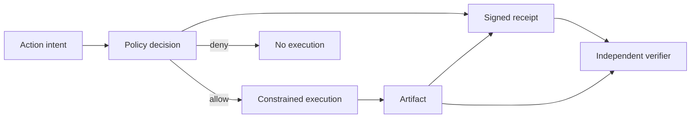

# The Evidence Plane

## Trust the receipt, not the label

An agent can print `verified`, attach a badge, or claim that a policy check passed. None of those statements proves that the named policy ran, that it authorized this action, or that the returned artifact is the artifact that was checked.

The evidence plane is the part of an agentic architecture that produces independently verifiable receipts for consequential actions. It complements the control plane:

- The control plane decides what may happen.
- The execution plane performs the action.
- The evidence plane binds the actor, decision, action, and result into a verifiable record.



## Receipt contract

A useful receipt binds at least:

| Claim | Question it answers |
|---|---|
| Receipt ID | Can this event be correlated and deduplicated? |
| Actor ID | Which workload identity acted? |
| Action | What operation was authorized? |
| Policy ID and decision | Which versioned rule allowed it? |
| Artifact digest | Is this the exact output covered by the receipt? |
| Issued-at time | When was the evidence produced? |
| Key ID and signature | Which trusted issuer attested it, and was it altered? |

Verification must fail closed on missing claims, unknown issuers, denied decisions, signature mismatch, and artifact mismatch. A receipt proves only the claims it cryptographically binds. It does not prove that the policy was correct, the signer was uncompromised, or the output was useful.

## Threat model

| Failure | Required control |
|---|---|
| Agent invents a `verified` field | Verify a signature from a separately trusted issuer |
| Receipt is copied to another result | Bind the artifact digest |
| Allowed action is changed after approval | Bind the normalized action and parameters |
| Old policy is presented as current | Bind a versioned policy ID and enforce verifier freshness rules |
| Signing key is stolen | Use hardware-backed asymmetric keys, rotation, and revocation |
| Logs are edited | Anchor receipt hashes in an append-only transparency system |

## Run the example

The dependency-free example uses HMAC to make the trust boundary easy to inspect:

```bash
python examples/evidence_plane_example.py
python -m unittest tests.test_evidence_plane -v
```

HMAC is intentionally not the production recommendation because issuer and verifier share the ability to sign. Replace it with asymmetric signatures, workload identity, protected key custody, and a published verification policy.

## Adoption sequence

1. Define the action schema and artifact boundary.
2. Move policy evaluation outside the model process.
3. Give execution a workload identity rather than a display name.
4. Issue the receipt only after the policy decision and artifact digest exist.
5. Verify receipts outside the producing agent.
6. Test tampering, replay, unknown keys, denied actions, and key rotation.

The design goal is not more trust language. It is a falsifiable claim: changing the action, decision, or artifact must make verification fail.
