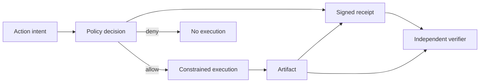

# Enforcement and evidence

> Merged from two earlier documents: Control Planes vs Prompts and The Evidence
> Plane. One puts the rule where the model cannot argue with it. The other makes
> the result checkable by somebody who was not there.

> The numbers in this document are worked examples on stated assumptions, or
> design targets. None of them are measurements. See the evidence standard in
> [CONTRIBUTING.md](../../CONTRIBUTING.md#evidence-standard).

## The problem

Two failures that look unrelated and are the same failure.

**The rule lives somewhere the model can be argued out of.** A system prompt is
a suggestion delivered in the same channel as the attack. It has no privileged
position. It is text, competing with other text, and whether it wins is a
probability that moves with every new phrasing and every model upgrade. You
would not secure a web application with strongly worded comments.

**The claim that the rule was followed comes from the thing being checked.** An
agent prints `verified`, attaches a badge, or reports that a policy check
passed. None of that proves the named policy ran, that it authorized this
specific action, or that the artifact you are holding is the artifact that was
checked. The label and the thing are produced by the same process.

Both are the same mistake: trusting an assertion made from inside the boundary
you are trying to establish.

## The mechanism

**Move the decision out of the model process.** Policies become code with tests,
evaluated by a component the model calls rather than a component the model
persuades. Permissions describe what an agent may do, not what it should
consider doing. Enforcement sits below the layer that reads text, so a request
that is denied never reaches the tool no matter how it is worded.

**Then bind the decision to the result.** Enforcement alone leaves you with logs
that say a check happened, written by the system that would also be wrong if the
check had been skipped. A receipt binds four things into one signed record:
which workload acted, which versioned policy allowed it, what the action was,
and the digest of what came out.

```
  intent ---> policy decision ---> constrained execution ---> artifact
                    |                                            |
                    |  allow                                     |
                    v                                            v
                 receipt <-------- binds actor, policy, action, digest
                    |
                    v
            independent verifier  (holds the artifact, checks the receipt)
```

The verifier is the point. It runs outside the producing agent, holds the
artifact independently, and fails closed on a missing claim, an unknown issuer,
a denied decision, a signature mismatch, or an artifact mismatch.

Three planes, and they are worth naming separately because teams routinely build
one and claim all three:

- The **control plane** decides what may happen.
- The **execution plane** performs the action.
- The **evidence plane** binds actor, decision, action, and result into a record
  someone else can check.

## Implementation detail

The material below is retained from the two source documents.

## The control plane in detail

### Why prompts fail as a control

The AI industry has a dangerous habit: trying to "prompt engineer" safety into existence.

```python
# This is how most teams implement AI safety
system_prompt = """
You are a helpful assistant. You MUST NOT:
- Reveal confidential information
- Execute dangerous commands
- Provide harmful advice

Always be safe and responsible.
"""
```

This doesn't work. Here's why:

#### Prompts Are Suggestions, Not Laws

| Analogy | Why It Fails |
|---------|--------------|
| Web Security | You wouldn't secure a login page with: "Please don't hack this" |
| Database Access | You wouldn't protect data with: "Only return rows the user can see" |
| File System | You wouldn't prevent deletion with: "Be careful with rm commands" |

Yet this is exactly what we do with AI agents.

### Control plane architecture

A **Control Plane** is infrastructure-level enforcement that operates BELOW the LLM layer:

```
┌─────────────────────────────────────────┐
│            User Request                  │
└────────────────┬────────────────────────┘
                 │
                 ▼
┌─────────────────────────────────────────┐
│         CONTROL PLANE                    │  ← Deterministic
│  ┌─────────────────────────────────┐    │
│  │  Permission Check               │    │
│  │  Policy Evaluation              │    │
│  │  Resource Boundaries            │    │
│  │  Audit Logging                  │    │
│  └─────────────────────────────────┘    │
└────────────────┬────────────────────────┘
                 │
        [ALLOWED or DENIED]
                 │
                 ▼ (only if ALLOWED)
┌─────────────────────────────────────────┐
│              LLM Layer                   │  ← Probabilistic
│         (Handles allowed tasks)          │
└─────────────────────────────────────────┘
```

### Five principles of the control plane

#### 1. Permissions, Not Prompts

```python
# Bad: Prompt-based safety
prompt = "Do not access files outside /home/user"

# Good: Permission-based safety
class AgentPermissions:
    allowed_paths = ["/home/user"]
    
    def can_access(self, path: str) -> bool:
        return any(path.startswith(p) for p in self.allowed_paths)
```

#### 2. Policies Are Code, Not Text

```python
# Bad: Policy in natural language
policy = "Only allow financial queries during business hours for tier-2+ users"

# Good: Policy as executable code
class FinancialQueryPolicy:
    def evaluate(self, request: Request, context: Context) -> Decision:
        if request.type != "financial_query":
            return Decision.SKIP
        
        if not context.is_business_hours():
            return Decision.DENY("Outside business hours")
        
        if context.user.tier < 2:
            return Decision.DENY("Requires tier 2+")
        
        return Decision.ALLOW
```

#### 3. Kernel-Level Enforcement

The control plane operates like an OS kernel. The LLM is a user-space process:

```python
class AgentKernel:
    def __init__(self, policies: list[Policy], permissions: Permissions):
        self.policies = policies
        self.permissions = permissions
        self.audit_log = AuditLog()
    
    def syscall(self, agent_id: str, action: str, resource: str) -> Result:
        """All agent actions go through the kernel."""
        
        # 1. Check permissions (capability-based)
        if not self.permissions.check(agent_id, action, resource):
            self.audit_log.denied(agent_id, action, resource, "NO_PERMISSION")
            return Result.DENIED
        
        # 2. Evaluate policies (rule-based)
        for policy in self.policies:
            decision = policy.evaluate(action, resource)
            if decision.is_deny():
                self.audit_log.denied(agent_id, action, resource, decision.reason)
                return Result.DENIED
        
        # 3. Execute with audit trail
        self.audit_log.allowed(agent_id, action, resource)
        return self._execute(action, resource)
```

#### 4. Audit Everything

```python
class AuditLog:
    def log_action(self, entry: AuditEntry):
        """Every action is logged with full context."""
        entry.timestamp = datetime.utcnow()
        entry.trace_id = current_trace_id()
        self.store.append(entry)
    
    def get_agent_history(self, agent_id: str) -> list[AuditEntry]:
        """Complete history of what an agent did."""
        return self.store.query(agent_id=agent_id)
    
    def find_violations(self, time_range: TimeRange) -> list[AuditEntry]:
        """Find any policy violations (should be empty with control plane)."""
        return self.store.query(
            time_range=time_range,
            status="DENIED"
        )
```

#### 5. Rollback Capability

```python
class TransactionalExecution:
    def execute_with_rollback(self, action: Action) -> Result:
        """Every action can be undone."""
        
        # Capture state before
        snapshot = self.capture_state(action.affected_resources)
        
        try:
            result = action.execute()
            
            if result.needs_review:
                # Hold in pending state
                self.pending_actions.add(action, snapshot)
                return Result.PENDING_REVIEW
            
            return result
            
        except Exception as e:
            # Automatic rollback on failure
            self.restore_state(snapshot)
            return Result.FAILED(e)
    
    def rollback_action(self, action_id: str):
        """Manually rollback any past action."""
        action, snapshot = self.history.get(action_id)
        self.restore_state(snapshot)
        self.audit_log.rollback(action_id)
```

### Prompts compared with control planes

| Aspect | Prompt-Based | Control Plane |
|--------|--------------|---------------|
| Enforcement | Suggestions | Laws |
| Reliability | Depends on the model and the attack | Depends on the code, and is testable |
| Bypass | Jailbreaks work | Cannot bypass |
| Audit | Hope LLM logged it | Every action logged |
| Rollback | Not possible | Full undo capability |
| Testing | "Does this prompt work?" | Unit tests for policies |
| Compliance | "We told it to be safe" | Provable enforcement |

### A worked control plane

```python
class EnterpriseAgentControlPlane:
    def __init__(self):
        self.permission_manager = PermissionManager()
        self.policy_engine = PolicyEngine()
        self.audit_system = AuditSystem()
        self.transaction_manager = TransactionManager()
    
    def handle_request(self, request: AgentRequest) -> AgentResponse:
        # Gate 1: Authentication
        if not self.authenticate(request):
            return AgentResponse.UNAUTHORIZED
        
        # Gate 2: Permission check
        permissions = self.permission_manager.get(request.agent_id)
        if not permissions.allows(request.action, request.resource):
            self.audit_system.log_denied(request, "PERMISSION_DENIED")
            return AgentResponse.FORBIDDEN
        
        # Gate 3: Policy evaluation
        policy_result = self.policy_engine.evaluate(request)
        if policy_result.is_deny():
            self.audit_system.log_denied(request, policy_result.reason)
            return AgentResponse.POLICY_VIOLATION
        
        # Gate 4: Execute with transaction wrapper
        with self.transaction_manager.transaction() as txn:
            result = self.execute(request)
            
            if policy_result.requires_review:
                txn.hold_for_review()
                return AgentResponse.PENDING_REVIEW
            
            txn.commit()
            self.audit_system.log_success(request, result)
            return AgentResponse.success(result)
```

### Where the rule lives, by approach

| Safety approach | Where the rule lives | Bypass route |
|-----------------|----------------------|--------------|
| No safety measures | Nowhere | Any request |
| Prompt engineering | In the model's context | Jailbreaks |
| System prompts | In the model's context, higher priority | Prompt injection |
| Model-level training | In the weights | Distribution shift, novel attacks |
| **Control plane** | **In code, outside the model process** | **Only a bug in the control plane, or a path that skips it** |

The rows differ in kind, not degree. The first four put the rule somewhere the
model can be argued out of. The last puts it somewhere the model cannot reach.

Violation rates are deliberately absent from this table. Any number you have
seen for these approaches came from one attack suite against one model, and it
does not transfer. If you need a number, build the suite for your system and
publish the suite alongside it.

### Which to use for what

#### Use Prompts For:
- Tone and style guidance
- Output formatting preferences
- Domain context and background
- Helpful suggestions and examples

#### Use Control Plane For:
- Security boundaries
- Data access restrictions
- Action permissions
- Compliance requirements
- Audit requirements
- Anything that MUST be enforced

## The evidence plane in detail

### Why a label is not evidence

An agent can print `verified`, attach a badge, or claim that a policy check passed. None of those statements proves that the named policy ran, that it authorized this action, or that the returned artifact is the artifact that was checked.

The evidence plane is the part of an agentic architecture that produces independently verifiable receipts for consequential actions. It complements the control plane:

- The control plane decides what may happen.
- The execution plane performs the action.
- The evidence plane binds the actor, decision, action, and result into a verifiable record.



### Receipt contract

A useful receipt binds at least:

| Claim | Question it answers |
|---|---|
| Receipt ID | Can this event be correlated and deduplicated? |
| Actor ID | Which workload identity acted? |
| Action | What operation was authorized? |
| Policy ID and decision | Which versioned rule allowed it? |
| Artifact digest | Is this the exact output covered by the receipt? |
| Issued-at time | When was the evidence produced? |
| Key ID and signature | Which trusted issuer attested it, and was it altered? |

Verification must fail closed on missing claims, unknown issuers, denied decisions, signature mismatch, and artifact mismatch. A receipt proves only the claims it cryptographically binds. It does not prove that the policy was correct, the signer was uncompromised, or the output was useful.

### Threat model

| Failure | Required control |
|---|---|
| Agent invents a `verified` field | Verify a signature from a separately trusted issuer |
| Receipt is copied to another result | Bind the artifact digest |
| Allowed action is changed after approval | Bind the normalized action and parameters |
| Old policy is presented as current | Bind a versioned policy ID and enforce verifier freshness rules |
| Signing key is stolen | Use hardware-backed asymmetric keys, rotation, and revocation |
| Logs are edited | Anchor receipt hashes in an append-only transparency system |

## The invariant

> Changing the action, the policy decision, or the artifact must make
> verification fail.

That is the whole claim, and it is falsifiable in four ways: alter a claim in
the receipt, swap the artifact, present an unknown key, or try to issue a
receipt for a denied decision.

## What this does not do

A receipt proves only the claims it cryptographically binds. It does not prove:

- **That the policy was correct.** A faithfully enforced bad rule is still a bad
  rule, and the receipt will look immaculate.
- **That the signer was uncompromised.** A stolen key produces valid receipts.
  Key custody, rotation, and revocation are the actual security boundary.
- **That the output was useful, safe, or true.** It was authorized. That is a
  different claim.
- **That the log is complete.** Receipts prove what happened for the events that
  produced them. Nothing here detects an event that was never recorded, which is
  what a transparency log is for.

The example ships with HMAC deliberately, so the trust boundary is easy to
inspect in one file. HMAC means issuer and verifier share the ability to sign,
which is precisely what you do not want in production. Replace it with
asymmetric signatures, workload identity, and protected key custody.

## The test

`tests/test_evidence_plane.py` covers the four ways the invariant can fail:

- A valid receipt verifies against its artifact.
- A tampered claim is rejected. Changing `action` from `report.publish` to
  `admin.delete` invalidates the signature.
- A substituted artifact is rejected, which is the claim most systems skip.
- An unknown key is rejected.
- A denied decision cannot be attested at all. The issuer raises rather than
  producing a receipt that says `deny`.

This was the first suite in the repository and the rest were written to match
its shape.

## When not to use this

- **Nothing consequential happens.** Receipts for a read-only summariser are
  ceremony.
- **You have nowhere to put the keys.** A signing key in the same process as the
  agent gives you a receipt the agent can forge. That is worse than no receipt,
  because it looks like evidence.
- **Nobody will ever verify.** If no party outside the producing system checks
  the receipt, you have built an expensive log. Identify the verifier before
  building the issuer.
- **The policy is not stable enough to version.** A receipt binding
  `policy://x/v3` is meaningless if v3 changed twice this week without a version
  bump.

## What to measure

| Signal | Why it matters |
|---|---|
| Share of consequential actions carrying a receipt | Coverage bounds everything else |
| Verification failures, split by cause | Tamper, artifact mismatch, unknown key and stale policy are different incidents |
| Receipts verified by a party outside the producer | If this is zero, the evidence plane is not running |
| Policy versions in flight | Several live versions means "which rule allowed this" has no answer |
| Key age and rotation lag | The receipt is only as good as the custody |
| Adversarial suite pass rate | Bypass and tampering tests, not an estimate |

## Anti-patterns

**A `verified: true` field the agent sets itself.** The label and the thing
produced by the same process.

**Signing the decision but not the artifact.** The receipt is then transferable
to any output, which is the failure the digest exists to prevent.

**An unversioned policy id.** `policy://publishing` binds nothing, because the
rule behind that name changes.

**Prompt-based safety with an audit trail.** The trail faithfully records that
you asked nicely.

**A verifier inside the agent.** Self-verification is a spell check.

## Reference implementations

| Component | Where it exists as running code |
|---|---|
| Signed, checkable records of what an agent did and under which policy | [TRACE](https://github.com/agentrust-io/trace-spec) |
| Policy evaluation outside the model process, on the tool call path | [cMCP](https://github.com/agentrust-io/cmcp) |
| Declared capability and scope for an agent, as a verifiable document | [Agent Manifest](https://github.com/agentrust-io/agent-manifest) |
| Policy kernel and enforcement patterns | [Agent Governance Toolkit](https://github.com/microsoft/agent-governance-toolkit) |

TRACE is the closest shipped thing to the evidence plane described here: a
record format plus a conformance suite, so a receipt can be checked by a party
that does not trust the producer. cMCP is the control plane half, enforcing on
the tool call path rather than in the prompt.

Both are open specifications with running code, which matters for this pattern
specifically: an evidence format nobody else can implement is not evidence, it
is a proprietary log with extra steps.

## Run the example

```bash
python examples/evidence_plane_example.py
python -m unittest tests.test_evidence_plane -v
```

## Adoption sequence

1. Define the action schema and the artifact boundary.
2. Move policy evaluation outside the model process.
3. Give execution a workload identity rather than a display name.
4. Issue the receipt only after both the policy decision and the artifact digest
   exist.
5. Verify receipts outside the producing agent.
6. Test tampering, replay, unknown keys, denied actions, and key rotation.

The design goal is not more trust language. It is a falsifiable claim.

## Related patterns

- [Routing before reasoning](./routing.md), for why a budget is not an access control
- [Silent execution](./silent-execution.md), for the capability check this proves ran
- [Grounded context](./grounded-context.md), for making a block provable rather than logged
